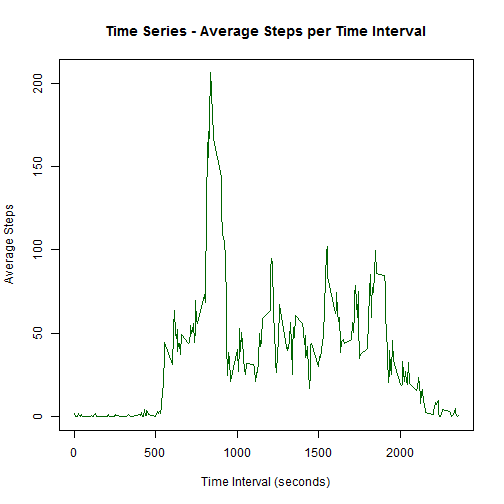

# Loading and Pre-Processing the Data

First we need to load and pre-process the data. I took a look at the data in Microsoft Excel and it looks very tidy. The missing values that are "NA" will load as missing values, as the default for R is "NA". Please make sure the data is in your working directory! We will also print out the summary of the variables 


```r
activitydata <- read.csv("activity.csv")
str(activitydata)
```

```
## 'data.frame':	17568 obs. of  3 variables:
##  $ steps   : int  NA NA NA NA NA NA NA NA NA NA ...
##  $ date    : Factor w/ 61 levels "2012-10-01","2012-10-02",..: 1 1 1 1 1 1 1 1 1 1 ...
##  $ interval: int  0 5 10 15 20 25 30 35 40 45 ...
```

You will notice that the variable 'date' has type Factor. We will now create a new POSIXlt variable that is the 'date' and 'interval' variables together as "Y-M-D H:M:S".


```r
activitydata$datetime <- strptime(paste(activitydata$date,activitydata$interval),format="%Y-%m-%d%S")
```

Let's check the first few rows of the data with this new variable.


```r
head(activitydata)
```

```
##   steps       date interval            datetime
## 1    NA 2012-10-01        0 2012-10-01 00:00:00
## 2    NA 2012-10-01        5 2012-10-01 00:00:05
## 3    NA 2012-10-01       10 2012-10-01 00:00:10
## 4    NA 2012-10-01       15 2012-10-01 00:00:15
## 5    NA 2012-10-01       20 2012-10-01 00:00:20
## 6    NA 2012-10-01       25 2012-10-01 00:00:25
```

## **Looking good!**

# What is the Mean Total Number of Steps Taken per Day?

Next we're going to sum the steps per day and eventually look at the mean. We'll create a new table of the total steps per day and look at the first few records, as well as the histogram of total steps per day.


```r
stepsperday <- aggregate(activitydata$steps,by=list(date=activitydata$date),FUN=sum)
names(stepsperday) <- c("date","sumsteps")
head(stepsperday)
```

```
##         date sumsteps
## 1 2012-10-01       NA
## 2 2012-10-02      126
## 3 2012-10-03    11352
## 4 2012-10-04    12116
## 5 2012-10-05    13294
## 6 2012-10-06    15420
```

```r
hist(stepsperday$sumsteps,main="Histogram - Total Steps Per Day",xlab="Total Steps Per Day",col="purple")
```

 

```r
meansteps <- prettyNum(mean(stepsperday$sumsteps,na.rm=TRUE),big.mark=",",digits=2)
mediansteps <- prettyNum(median(stepsperday$sumsteps,na.rm=TRUE),big.mark=",",digits=2)
```

The mean number of total steps per day is **10,766** and the median number of total steps per day is **10,765**.

# What is the Average Daily Activity Pattern?

We need a table by the interval level and the average steps across all days in that interval level. We'll create this here and look at the first few rows as well as the time series plot.


```r
avgstepsperinterval <- aggregate(activitydata$steps,by=list(interval=activitydata$interval),FUN=mean,na.rm=TRUE)
names(avgstepsperinterval) <- c("interval","avgsteps")
head(avgstepsperinterval)
```

```
##   interval  avgsteps
## 1        0 1.7169811
## 2        5 0.3396226
## 3       10 0.1320755
## 4       15 0.1509434
## 5       20 0.0754717
## 6       25 2.0943396
```

```r
plot(avgstepsperinterval$interval,avgstepsperinterval$avgsteps,type="l",main="Time Series - Average Steps per Time Interval",xlab="Time Interval (seconds)",ylab="Average Steps",col="darkgreen")
```

 

```r
maxinterval <- prettyNum(avgstepsperinterval[which.max(avgstepsperinterval$avgsteps),1],big.mark=",",digits=2)
maxintervalhigh <- prettyNum(avgstepsperinterval[which.max(avgstepsperinterval$avgsteps),1]+5,big.mark=",",digits=2)
maxintervalsteps <- prettyNum(avgstepsperinterval[which.max(avgstepsperinterval$avgsteps),2],big.mark=",",digits=2)
maxintervalhours <- prettyNum(avgstepsperinterval[which.max(avgstepsperinterval$avgsteps),1]/60,big.mark=",",digits=4)
maxintervalhourshigh <- prettyNum((avgstepsperinterval[which.max(avgstepsperinterval$avgsteps),1]+5)/60,big.mark=",",digits=4)
```

The interval with the highest number of average steps per day number is between **835** and **840** seconds (or between 13.92 and 14 hours) and the average number of steps in this interval is **206**. Maybe this guy goes for a walk just after lunch every day, either that or he has to run across campus for his 2pm class.

# Imputing Missing Values

We will do some analysis of the missing values to reduce bias in our calculations and summaries.


```r
nummissingdays <- prettyNum(sum(is.na(activitydata$steps)),big.mark=",",digits=2)
```

The number of missing values in the data set is **2,304**.

I will use the average of each 5 minute interval to fill in the missing data. I think this is more precise than the mean of the entire day. We already have our data set of the average steps per day in each interval. All we need to do is merge this with the original data set. We're going to create a new data frame so we can preserve the old one. Then if the value of steps is NA, we just replace the value of steps with the associated interval mean.


```r
activitydata2 <- merge(activitydata,avgstepsperinterval)
endnum <- length(activitydata2$steps)
for(i in 1:endnum){if(is.na(activitydata2[i,2])){activitydata2[i,2]<-activitydata2[i,5]}}
nummissingdaysnew <- prettyNum(sum(is.na(activitydata2$steps)),big.mark=",",digits=2)
```

The number of missing values in the new data set is now **0**.

Next we're going to look at this new imputed data and sum the steps per day and eventually look at the mean. We'll create a new table of the total steps per day and look at the first few records, as well as the histogram of total steps per day.


```r
stepsperday2 <- aggregate(activitydata2$steps,by=list(date=activitydata2$date),FUN=sum)
names(stepsperday2) <- c("date","sumsteps")
head(stepsperday2)
```

```
##         date sumsteps
## 1 2012-10-01 10766.19
## 2 2012-10-02   126.00
## 3 2012-10-03 11352.00
## 4 2012-10-04 12116.00
## 5 2012-10-05 13294.00
## 6 2012-10-06 15420.00
```

```r
hist(stepsperday2$sumsteps,main="Histogram - Total Steps Per Day (With Imputed values)",xlab="Total Steps Per Day",col="violetred")
```

 

```r
meansteps2 <- prettyNum(mean(stepsperday2$sumsteps,na.rm=TRUE),big.mark=",",digits=2)
mediansteps2 <- prettyNum(median(stepsperday2$sumsteps,na.rm=TRUE),big.mark=",",digits=2)
```

The mean number of total steps per day is **10,766** and the median number of total steps per day is **10,766**.

The data didn't change much by imputing the missing values. The histogram has different values but the same shape. The averages did not change at all and the median is only 1 more.

# Are there differences in activity patterns between weekdays and weekends?

First we need to create a variable in our data that is the day of the week. Then we need to assign a factor "weekday" or "weekend" based on the day of the week.


```r
activitydata2$weekday <- weekdays(activitydata2$datetime)
activitydata2$weekend <- as.factor(c("weekend","weekday"))
activitydata2$weekend <- ifelse(activitydata2$weekday == "Saturday" | activitydata2$weekday == "Sunday", "weekend", "weekday")
```

Let's take a look at the data to make sure that it is looking ok.


```r
head(activitydata2,10)
```

```
##    interval    steps       date   datetime avgsteps   weekday weekend
## 1         0 1.716981 2012-10-01 2012-10-01 1.716981    Monday weekday
## 2         0 0.000000 2012-11-23 2012-11-23 1.716981    Friday weekday
## 3         0 0.000000 2012-10-28 2012-10-28 1.716981    Sunday weekend
## 4         0 0.000000 2012-11-06 2012-11-06 1.716981   Tuesday weekday
## 5         0 0.000000 2012-11-24 2012-11-24 1.716981  Saturday weekend
## 6         0 0.000000 2012-11-15 2012-11-15 1.716981  Thursday weekday
## 7         0 0.000000 2012-10-20 2012-10-20 1.716981  Saturday weekend
## 8         0 0.000000 2012-11-16 2012-11-16 1.716981    Friday weekday
## 9         0 0.000000 2012-11-07 2012-11-07 1.716981 Wednesday weekday
## 10        0 0.000000 2012-11-25 2012-11-25 1.716981    Sunday weekend
```

Yes, looking good. Now we just need to make the plot showing weekdays and weekends separately.


```r
avgstepsperinterval2 <- aggregate(activitydata2$steps,by=list(interval=activitydata2$interval,weekend=activitydata2$weekend),FUN=mean,na.rm=TRUE)
names(avgstepsperinterval2) <- c("interval","weekend","avgsteps")
library(lattice)
xyplot(avgstepsperinterval2$avgsteps~avgstepsperinterval2$interval|avgstepsperinterval2$weekend,avgstepsperinterval2,type="l",xlab="Time Interval (seconds)",ylab="Average Steps",main="Time Series - Average Steps per Time Interval",layout=c(1,2))
```

 
